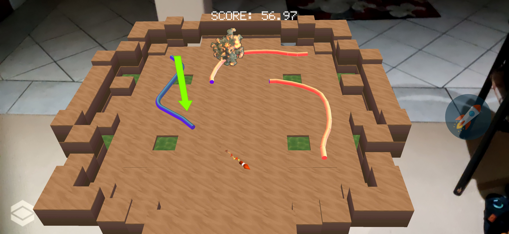

# LineAR

An AR game made using Unity 3D and Vuforia engine as cmpt-742 project at Simon Fraser University.

### Gameplay

This game is an arcade AR game. The player starts the game by finding an anchor and tapping it to spawn the arena.

The player's curve can be identified with a green marker on the screen.
Also, to add a bit more dynamics to the game, the player and the bots can shoot through other player's curve.

The player SHOULD avoid collision with the two other bots and walls of the boundariers.

### Build

The game is currently build for android and it is available to [download](https://drive.google.com/open?id=16jg8Q8EG6w5vxX0EHHvlRYqIpfesFqUS).

### Future 
 * IOS build
 * More playgrounds
 * ***Multiplayer***
